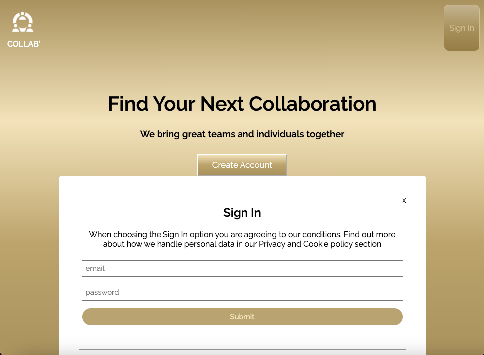

# Collab' - Coding Collaboration Finder

## User Interface

---

## Description 

This platform allows individuals and teams to register, log in, and explore potential coding collaborators. Users provide project details such as name/working title, description, and an image for ongoing or planned projects they wish to build or collaborate on. Members can easily browse through profiles, initiating chats when mutual project interests align. Leveraging MongoDB for data storage and encrypted user passwords, the application enhances security and utilizes cookies to streamline user login and usage.

---

## Technologies used

- React 
- MongoDB
- React Router
- Axios
- Authentication
- Password encryption
- Cookie storeage
- CSS

